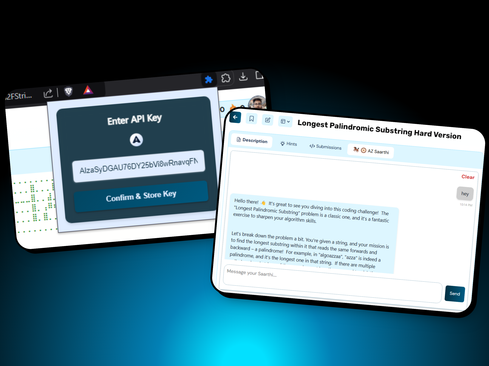

## **🤖 AZ Saarthi (AI-Powered DSA Assistant for AlgoZenith)** 🚀  
Boost your **AlgoZenith** coding experience with **AZ Saarthi**, an AI-powered Chrome extension. Get **smart hints, explanations, and alternative solutions** right in the problem interface.

---




### **✨ Features**  
✅ **AI-Powered Hints & Explanations** – Get step-by-step guidance, complexity analysis, and optimization suggestions  
✅ **Seamless AlgoZenith Integration** – Works directly on the problem page without disrupting your workflow  
✅ **Smart Test Case Generation** – Detect edge cases and generate example inputs  
✅ **Markdown Support** – Beautifully formatted explanations with code snippets using `marked.js`  
✅ **Lightweight & Efficient** – Minimal performance impact for a smooth experience  
✅ **Live Updates** – Uses a **MutationObserver** to dynamically detect problem pages  

---

### **🎨 Tech Stack & Design**  
💡 **Tech:**

     

🎨 **Color Palette:**

 `#1E1E1E`, `#FFAA00`, `#FFD700`, `#333333`, `#FFFFFF`  

💎 **UI Focus:** 

Modern, clean, and highly intuitive for effortless problem-solving  

---

### **📁 Folder Structure**  
```bash
├── assets
│   ├── favicon.png
│   ├── logo16.png
│   ├── logo32.png
│   ├── logo48.png
│   └── logo128.png
├── .gitignore
├── background.js
├── content.js
├── index.js
├── inject.js
├── LICENSE
├── marked.js
├── manifest.json
├── popup.html
└── readme.md
```


---

### **🔧 Installation & Usage**  
1️⃣ **Download or clone** this repo.  
2️⃣ Open **Chrome → Extensions → Developer Mode**.  
3️⃣ Click **Load Unpacked** and select the project folder.  
4️⃣ Head to **AlgoZenith**, click on the **extension icon**, where you need to provide your [**API keys**](https://aistudio.google.com/api-keys), and then you can start using the extension.  


